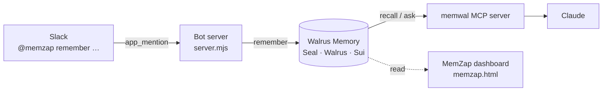

# MemZap
 
**Memory that travels with you across every app you use.**
 
Tell a Slack bot to remember something. Recall it in Claude. The memory never lives inside either app — it's encrypted on [Walrus](https://walrus.xyz), anchored on Sui, and owned by your keys.
 
 
---
 
## The problem
 
AI memory is trapped per app. What you tell Claude stays in Claude. What happens in Slack stays in Slack. Every tool starts from zero, and when memory *does* exist, it lives in a vendor's database — you can't verify it, move it, or take it with you.
 
MemZap anchors memory **once**, in a place you own, and lets every app read and write to it.
 
## What it does
 
Tag the bot in any Slack channel:
 
```
@memzap remember the launch is targeting August 2026
```
 
MemZap captures the message **plus where it came from** — channel, author, and a permalink — and writes it to your encrypted Walrus memory space. A ✓ reaction confirms it's stored.
 
Then ask Claude:
 
```
what launch date did I save?
```
 
Claude recalls it through the Walrus Memory MCP server — answering from the memory you wrote in Slack. Not because Slack and Claude are integrated, but because they both read from the same memory **you** own.
 
A web dashboard shows every stored memory, its Slack origin, and its Walrus blob ID — proof it lives in neither app.
 
## Architecture
 

 
Two apps, one owned memory in the middle. Slack writes from one side, Claude reads from the other, and the dashboard reads the same space directly.
 
- **Write path** — a Slack bot (`@slack/bolt`, Socket Mode) catches the mention and calls `memwal.remember()` through the Walrus Memory relayer.
- **Storage** — the relayer embeds the text, encrypts it with **Seal**, and stores the blob on **Walrus**. A **Sui** contract records ownership.
- **Read path (Claude)** — the Walrus Memory **MCP server** gives Claude `memwal_recall` with zero custom code. Claude signs in through a browser flow, so no keys live in its config.
- **Read path (dashboard)** — a small local API on the same server exposes recall to the web UI. The delegate key never leaves the server.
## Built on the Sui stack
 
| Layer | What it does |
| --- | --- |
| **Walrus** | Decentralized blob storage — every memory is a durable, content-addressed blob |
| **Seal** | Encrypts each memory before it touches storage |
| **Sui** | On-chain ownership and delegated access control over the memory space |
| **Walrus Memory** | The memory layer (`@mysten-incubation/memwal`) — relayer, SDK, and MCP server |
| **MCP** | Lets Claude (and any MCP client) read the memory natively |
 
## Tech stack
 
- Node.js (ES modules)
- `@slack/bolt` — Slack bot, Socket Mode (no public URL needed)
- `@mysten-incubation/memwal` — Walrus Memory SDK
- `@mysten-incubation/memwal-mcp` — MCP server for Claude
- Vanilla HTML/CSS/JS dashboard (single file, no build step)
## Repo
 
```
.
├── server.mjs        # the bridge: Slack write path + local read/write API
├── memzap.html       # dashboard — setup wizard + live shared-memory view
├── .env.example      # environment template (copy to .env, fill in)
└── README.md
```
 
## Setup
 
### 1. Prerequisites
 
- Node.js 20.6+ (`node -v`)
- A Walrus Memory account — generate an account ID + delegate key at [staging.memory.walrus.xyz](https://staging.memory.walrus.xyz) (testnet)
- A Slack workspace you can install an app into
### 2. Create the Slack app
 
At [api.slack.com/apps](https://api.slack.com/apps) → **Create New App → From manifest**, paste:
 
```yaml
display_information:
  name: MemZap
features:
  bot_user:
    display_name: memzap
    always_online: true
oauth_config:
  scopes:
    bot:
      - app_mentions:read
      - chat:write
      - reactions:write
      - channels:read
      - users:read
settings:
  event_subscriptions:
    bot_events:
      - app_mention
  socket_mode_enabled: true
```
 
Install to your workspace, then collect:
- **Bot token** (`xoxb-…`) — OAuth & Permissions
- **App token** (`xapp-…`) — Basic Information → App-Level Tokens → generate with `connections:write`
- **Signing secret** — Basic Information → App Credentials
### 3. Configure and run the bridge
 
```bash
npm install @slack/bolt @mysten-incubation/memwal
cp .env.example .env        # then fill in your values
node --env-file=.env server.mjs
```
 
You should see `MemZap API → http://localhost:8787` and `MemZap bridge live`.
 
### 4. Connect Claude
 
In **Claude → Settings → Developer → Edit Config**, add:
 
```json
{
  "mcpServers": {
    "memzap": {
      "command": "npx",
      "args": [
        "-y", "@mysten-incubation/memwal-mcp",
        "--staging", "--namespace", "slack"
      ]
    }
  }
}
```
 
Fully quit and reopen Claude. The first memory tool call opens a browser sign-in — use the wallet that owns your memory account.
 
### 5. Open the dashboard
 
Open `memzap.html` as a local file in your browser. With the server running, the bridge bar turns green and the dashboard reads your real memories live.
 
## Try it
 
1. In Slack: `@memzap remember the TGE is targeting August 2026`
2. In Claude: `what launch date did I save?`
3. In the dashboard: see the entry, its Slack origin, and its Walrus blob ID.
## Network
 
MemZap defaults to **Walrus testnet** (`--staging`). Testnet WAL/SUI are free from faucets. Note that testnet epochs are short (~1 day) and data may be wiped, so write fresh demo memories right before showing it. Switch to mainnet by changing the relayer URL in `.env` and the MCP flag to `--prod`.
 
## Security
 
- The delegate private key lives **only** in the server's environment. The dashboard talks to `localhost`; Claude signs in via browser login. Neither ever sees the key.
- `.env` is gitignored. Never commit it — it controls your memory account.
## Roadmap
 
- Click-through to the Walrus explorer for each blob (on-chain verification)
- Per-agent delegate keys instead of a shared account
- Namespaces per team / project, managed from the dashboard
- Mainnet deployment with a hosted bridge
